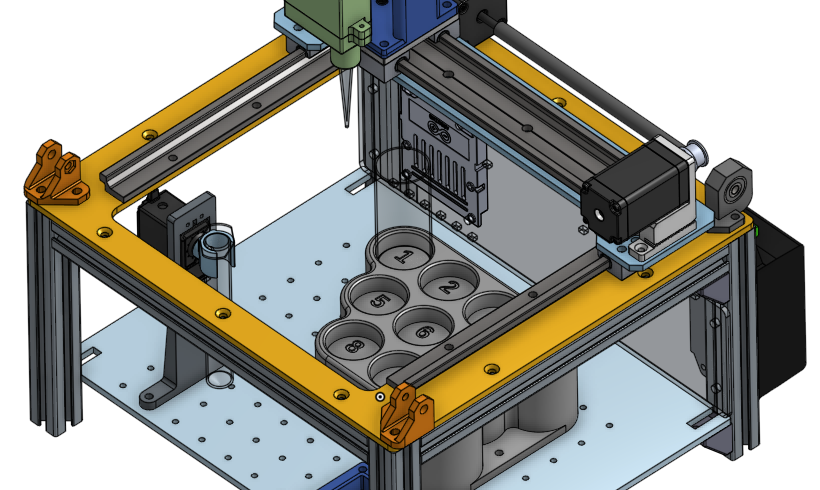

# Electrolyte Mixing Station

## Introduction


### Jump to the [Workspace Notebook](Workspace.ipynb) for instructions on how to use the mixing station!

## Installing Dependencies

Run the following in the root directory:

```
pip install .
```

Or possibly:

```
python3 -m pip install .
```

## References
1. [Smart Pump Module](https://www.theleeco.com/product/smart-pump-module/#resources)