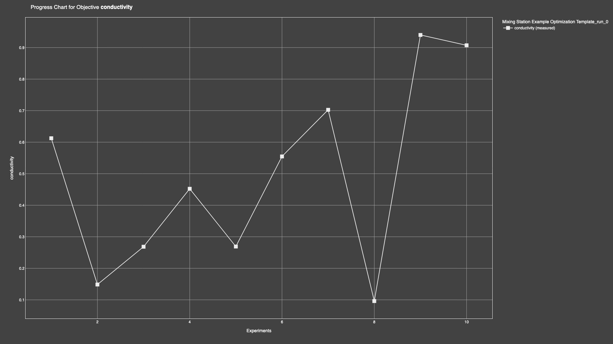

# Electrolyte Mixing Station

## Introduction

The Electrolyte Mixing Station is a automated platform, designed to mix microlitres of different liquid electrolytes - using a pressure-based volume control module - and perform electrochemical analyses on the resulting mixtures at temperatures from -20 to 60C.


### Be sure to follow all the steps to set up the virtual environment!

## Instal Dependencies

Build venv in root directory:

```
python -m venv .venv
```

Upgrade pip:

```
.venv/bin/pip install --upgrade pip
```

Install dependencies into new venv:

```
.venv/bin/pip install -e .
```

Activate venv:

```
source .venv/bin/activate
```

Note: Replace *bin* with *Scripts* if using windows.

## Set up SquidstatPyLibrary

Download latest *.whl* file from [here](https://github.com/Admiral-Instruments/AdmiralSquidstatAPI/tree/main/SquidstatLibrary/mac/pythonWrapper). Move the file to the repository root directory and run the following command:

```
.venv/bin/pip install FILE.whl
```

You can find documentation for the SquidstatPyLibrary [here](https://admiral-instruments.github.io/AdmiralSquidstatAPI/).

## Download ATEN RS232 to USB Driver

The Laird PID temperature controller uses RS232 to communicate, which requires an [adapter](https://www.aten.com/global/en/products/usb-solutions/converters/uc232a1/) to convert the signal to a 5V logic level for USB. Download the correct driver [here](https://www.aten.com/global/en/supportcenter/info/downloads/?action=display_product&pid=1142). Installing the drivers may require you to restart your computer.

## Set up Atinary SDK

Download latest *.tar.gz* file from [here](https://enterprise.atinary.com/download/). Move the file to */electrolyte-mixing-station* and run the following command:

```
.venv/bin/pip install FILE.tar.gz
```

You can find documentation for the Atinary SDK [here](https://enterprise.atinary.com/documentation/docs/sdlabs_sdk/installation.html).

## Install Atinary SDL Wrapper

The SDL Wrapper is a codebase created by Atinary, for quick and easy set up of optimisation campaigns using a json config file. Install via the following command:

```
.venv/bin/pip install git+https://github.com/Atinary-technologies/sdlabs_wrapper.git
```

## Using Platformio to Flash Latest Firmware

Install the [PlatformIO VSCode Extension](https://docs.platformio.org/en/latest/integration/ide/vscode.html) and open a new Pio terminal (found in *Quick Access/Miscellaneous*). Change directory to either *gantry-kit* or *fluid-handling-kit* in the terminal, then connect the the target Arduino Nano via USB and run the following command:

```
cd gantry-kit/
```

```
pio run --target upload
```

## Device Configuration

Com port addresses for each device can be found [here](data/devices/hardcoded_values.json). To add a new device, simply copy and paste the last device entry, increment the ID and rename the COM port addresses. The easiest way to determine these addresses, is to connect the device(s) and go to [PlatformIO's](https://docs.platformio.org/en/latest/integration/ide/vscode.html) *Devices* tab.

By toggling the booleans, you can activate or deactivate the various com port connections for scenarios where not all connections are needed.

# Run a Campaign

A campaign can be run using a command line tool, with the specifics of the campaign taken from [here](data/config/conductivity_optimiser.json). For each device, open a new terminal and run the following command:

```
run-campaign --device microtron_01
```

**Remember to include the volume of each chemical added to the containers [here](data/recipes/campaign_start.csv), before beginning the campaign!**

Run `run-campaign --help` for more information.

To monitor the campaign remotely, log in to [Atinary](https://enterprise.atinary.com/home/login) and navigate to the *Running Campaigns* tab on the dashboard. You can then decide on which charts to use to display the data, like so:



*Jump to the [jupyter notebook](instructions.ipynb) for further, interactive guidance on how to use the mixing station!*

## Recommended Extensions

For easy viewing and editing of CSVs, it is recommended that you download [this CSV extension](https://marketplace.visualstudio.com/items?itemName=ReprEng.csv) for VS Code.

## References
1. [Smart Pump Module](https://www.theleeco.com/product/smart-pump-module/#resources)
2. [Laird Temperature Controller](https://lairdthermal.com/products/product-temperature-controllers/tc-xx-pr-59-temperature-controller?creative=&keyword=&matchtype=&network=x&device=c&gad_source=1&gclid=CjwKCAiAzPy8BhBoEiwAbnM9O_ueQ3Ph8NvZ4LYCpqO9oUzX78J1sfagfGnYWUDeDpQ8P9rKzc11pBoCUR8QAvD_BwE)
3. [PCX Peltier Module](https://lairdthermal.com/products/thermoelectric-cooler-modules/peltier-thermal-cycling-pcx-series)
4. [Kern Mass Balance](https://www.kern-sohn.com/shop/en/products/laboratory-balances/precision-balances/PCD-2500-2/)
5. [Boxer Pump](https://www.boxerpumps.com/peristaltic-pumps-for-liquid/29qq/)
6. [Atinary Self-Driving Labs](https://scientia.atinary.com/sdlabs/academic/dashboard)
7. [Squidstat API Manual](https://admiral-instruments.github.io/AdmiralSquidstatAPI/index.html)